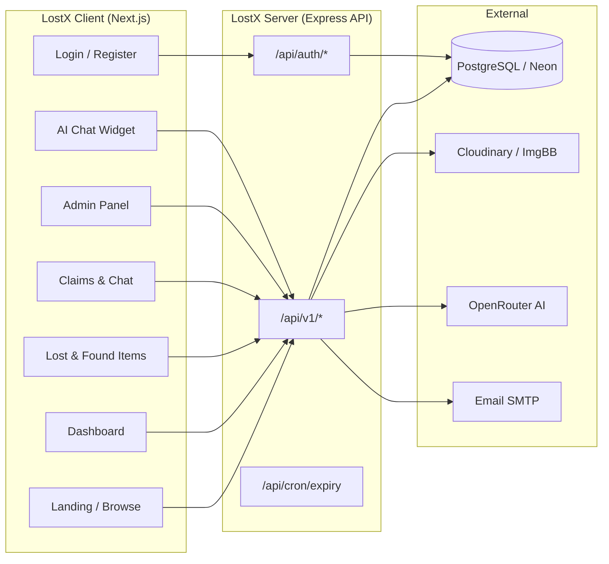

# LostX Client

LostX is a university lost-and-found platform for campus students. Users report lost or found items, browse listings, get smart matches, submit verified claims, and coordinate safe handoffs with admin oversight.

This repository is the **Next.js frontend**. It talks to the [LostX Server](../LostX-Server) REST API.

---

## Features

### For students
- **Landing page** — product overview, how-it-works, and feature highlights
- **Authentication** — register, login, email verification, forgot/reset password, Google OAuth
- **Dashboard** — stats, recent activity, quick actions, and claim progress
- **Lost items** — create, edit, view, and manage your lost reports with photos and campus locations
- **Found items** — post items you found and track their status
- **Browse** — search all campus listings by keyword, category, and building
- **Smart matching** — see likely matches between lost and found reports
- **Claims** — submit ownership claims with verification answers and track approval status
- **Claim chat** — message inside a claim after admin approval to arrange pickup
- **Notifications** — in-app updates for claims, matches, and item status changes
- **AI chatbot** — floating widget to ask natural-language questions and get item suggestions (RAG-powered backend)
- **Profile & settings** — account details, privacy, and preferences
- **Dark / light mode**

### For admins
- **Admin dashboard** — platform overview and metrics
- **Manage claims** — review, approve, or reject ownership claims
- **Manage items** — moderate lost/found listings, feature items, handle reports
- **User reports** — review suspicious users or fake listings
- **Admin settings**

---

## Tech stack

| Layer | Technology |
|-------|------------|
| Framework | Next.js 15 (App Router) |
| UI | React 19, Tailwind CSS v4, shadcn/ui, Radix UI |
| Forms | React Hook Form, TanStack Form, Zod |
| Data fetching | TanStack React Query, Axios |
| Auth | better-auth (via backend), JWT cookies |
| Animation | Framer Motion |
| Charts | Recharts |
| PDF / export | pdf-lib, html2canvas, JSZip |
| Language | TypeScript |

---

## Project flow



### User journey

1. **Sign up / sign in** — email + password or Google OAuth through the backend auth service.
2. **Report an item** — post a lost or found item with title, photo, category, campus building, and date.
3. **Browse & match** — search listings; LostX highlights possible matches by category, location, and date.
4. **Submit a claim** — answer verification questions to prove ownership of a found item.
5. **Admin review** — campus admins approve or reject the claim before contact details are shared.
6. **Handoff & return** — chat with the finder/owner, confirm receipt, and mark the item as returned.

---

## Prerequisites

- **Node.js** 20+
- **pnpm** 9+ (recommended — see `packageManager` in `package.json`)
- **LostX Server** running locally on port `5000` (or a deployed API URL)

---

## Local installation

### 1. Clone and install

```bash
git clone https://github.com/iktushar01/LostX.git
cd LostX/LostX-Client   # or your client folder path
pnpm install
```

### 2. Environment variables

Copy the example file and fill in values:

```bash
cp .env.example .env.local
```

| Variable | Description |
|----------|-------------|
| `NEXT_PUBLIC_API_BASE_URL` | Backend API base URL (local: `http://localhost:5000/api/v1`) |
| `ACCESS_TOKEN_SECRET` | Must match the same secret in LostX-Server |

Example `.env.local`:

```env
NEXT_PUBLIC_API_BASE_URL=http://localhost:5000/api/v1
ACCESS_TOKEN_SECRET=your_shared_secret_here
```

### 3. Start the backend first

In the server repo:

```bash
cd ../LostX-Server
npm install
cp .env.example .env
# fill in DATABASE_URL and other required vars
npx prisma migrate dev
npm run dev
```

The API should be available at `http://localhost:5000`.

### 4. Start the client

```bash
cd ../LostX-Client
pnpm dev
```

Open [http://localhost:3000](http://localhost:3000).

---

## Scripts

| Command | Description |
|---------|-------------|
| `pnpm dev` | Start development server |
| `pnpm build` | Production build |
| `pnpm start` | Run production build locally |
| `pnpm lint` | Run ESLint |

---

## Project structure

```
src/
├── app/                    # Next.js App Router pages
│   ├── (authRouteGroup)/   # login, register, verify-email, forgot-password
│   ├── (commonLayout)/     # landing page, public profile
│   ├── (dashboardLayout)/  # dashboard, lost/found, browse, claims, admin
│   └── api/                # Next.js route handlers (OAuth callback)
├── actions/                # Server actions
├── components/             # UI components (landing, dashboard, chatbot, admin)
├── services/               # API service layer
├── hooks/                  # React hooks
├── lib/                    # Utilities, auth helpers
└── types/                  # TypeScript types
```

---

## Deploy to Vercel

1. Import this repo as a Vercel project.
2. **Root Directory**: set to the client folder if inside a monorepo, or leave empty if this repo is the client root.
3. **Framework Preset**: Next.js (auto-detected).
4. **Build Command**: `next build --no-lint` (configured in `vercel.json`).
5. Set environment variables from `.env.example`:
   - `NEXT_PUBLIC_API_BASE_URL` — deployed backend URL (e.g. `https://lost-x-server.vercel.app/api/v1`)
   - `ACCESS_TOKEN_SECRET` — same value as backend
6. Deploy from `main` with **Clear build cache** if upgrading Next.js.

The backend must be deployed separately with `FRONTEND_URL` pointing to this client URL.

---

## Related

- **Backend API**: [LostX-Server](../LostX-Server)
- **Production client**: https://lost-x.vercel.app
- **Production API**: https://lost-x-server.vercel.app
